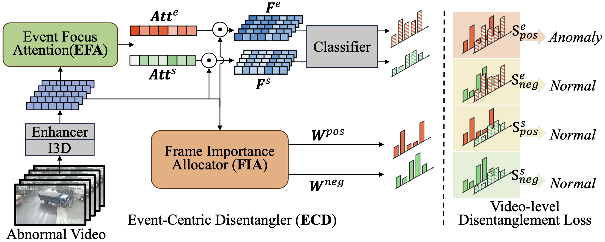

# ECD
The official implementation of "[EDC: Event-Centric Disentangler for Weakly Supervised Video Anomaly Detection]".

## Abstract
Weakly supervised video anomaly detection (WVAD) aims to detect where abnormal events occur in videos using only video-level labels during training. Many existing WVAD methods concentrate on learning comprehensive representations for each frame, making them susceptible to interference from irrelevant backgrounds or scenes. In this paper, we address this challenge by introducing disentangled representation learning to WVAD, presenting a new modular component named the Event-Centric Disentangler (ECD). Specifically, our ECD incorporates an Event Focus Attention (EFA) module, estimating channel-wise attention to focus on event representations while filtering out irrelevant information from backgrounds or scenes. Alongside EFA, a Frame Importance Allocator (FIA) learns frame-wise weighting factors to aggregate frame-level predictions for the generation of video-level predictions. Furthermore, we introduce a video-level contrastive loss to provide disentanglement supervision for ECD training, within the constraints of weakly supervised settings.

## Environment
    Python=3.8.16
    Pytorch=2.0.0
    Torchvision=0.15.2
    cudatoolkit 11.7

## Dataset
**We use the extracted I3D features for UCF-Crime and XD-Violence datasets from the following works:**
> [**UCF-Crime 10-crop I3D features**](https://github.com/Roc-Ng/DeepMIL)
> 
> [**XD-Violence 5-crop I3D features**](https://roc-ng.github.io/XD-Violence/)

## Train
    python main.py --dataset datasetname --model_type model_name --version train --root_dir data_root

## Inference
    python infer.py --dataset datasetname --model_type model_name --model_path ./ckpts/... --root_dir data_root

## Thanks to
- [RTFM](https://github.com/tianyu0207/RTFM)
- [UR-DMU](https://github.com/henrryzh1/UR-DMU)